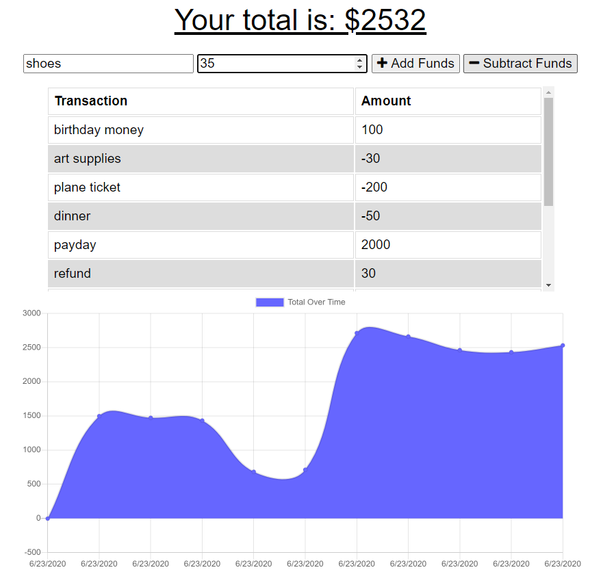

 
  # Budget Tracker App

  [](https://github.com/emijoha)

  ## Description

  A Budget Tracker Progressive Wed App that lets users keep track of expenses and deposits, even offline.

  ### User Story

  ```
  AS AN avid traveller
  I WANT to be able to track my withdrawals and deposits with or without a data/internet connection
  SO THAT my account balance is accurate when I am traveling
  ```

  ### Technologies

  * Express server and routing
  * Mongoose for backend database
  * IndexDB for caching
  * PWA: Manifest, Service Worker
  
  ## Table of Contents

  * [Installation](#installation)
  * [Usage](#usage)
  * [License](#license)
  * [Contributing](#contributing)
  * [Tests](#tests)
  * [Questions](#questions)

  ## Installation

  To install this application, visit the [deployed site](https://shielded-hamlet-24008.herokuapp.com/) and click the encircled '+' at the end of the address bar to download the PWA. 
  
   
  
  This will create a shortcut on your device to the web app for easy access.
  
  ## Usage

  This app is ideal for users that need a fast and easy way to track their money, at anytime and anywhere without an internet connection. Whenever the app is back online, all stored expenses and deposits are backed-up on the backend database. 

  To use this app: 
  1. Visit the [deployed site](https://shielded-hamlet-24008.herokuapp.com/) or click on the downloaded PWA shortcut.
  2. Below the 'total' display, enter the name and amount of your transactions, and click 'Add Funds' or 'Subtract Funds' based on the transaction type.
  3. The transaction will appear in a list directly below, and affect the 'Total Over Time' chart at the bottom of the page.
  4. Any transactions logged while internet connection is offline will still appear in the list and be added to the chart.
  5. Anytime the connection is back online, locally stored transaction will be pushed to the main backend Mongo database. 

   

  ## License

  MIT License

  Copyright 2020 Emilia Josefina Hartline.

  ## Contributing

  Pull requests are welcome. 

  ## Tests

  There are currently no tests.

  ## Questions

  Feel free to contact us with any questions regarding this project!

  
  
  [](https://github.com/emijoha)

  Email Emilia Josefina Hartline at ejhartline@gmail.com 
  